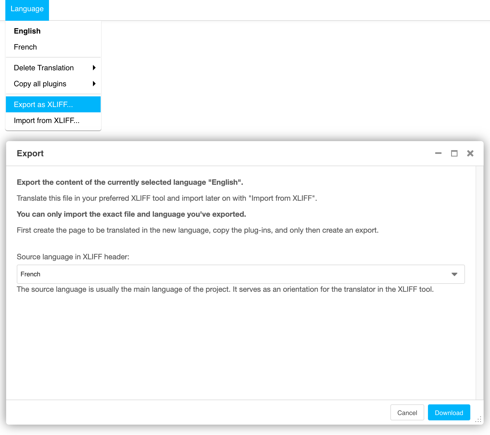
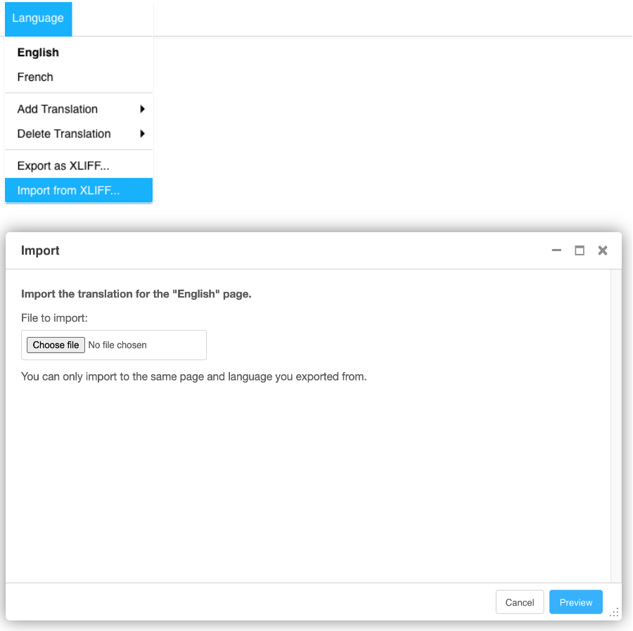
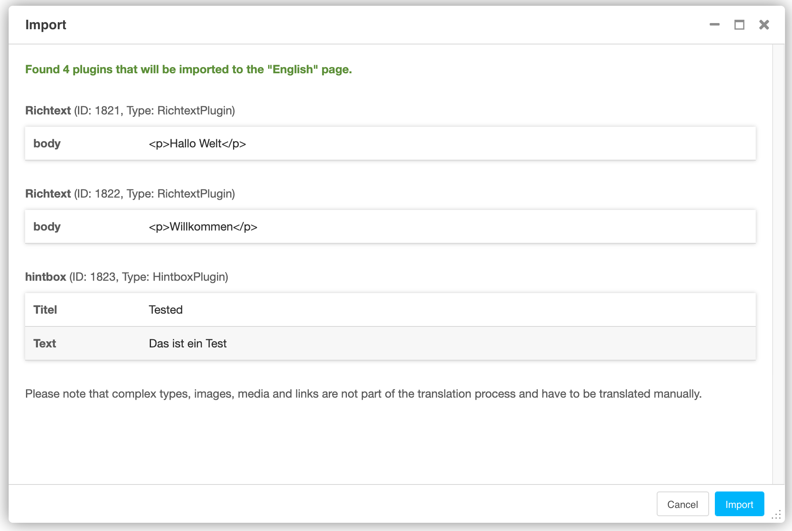

# djangocms-xliff
[](https://github.com/energie360/djangocms-xliff/actions/workflows/tests.yaml)

XLIFF (XML Localization Interchange File Format) is an XML-based format created
to standardize the way localizable data are passed between and among tools during a localization process.

With djangocms-xliff it is possible to export all text objects from a page into an XLIFF-compatible file and re-import the file at the end of the translation process.

## Installation

Before the installation you need to make sure, that your
localization / internalization are set up properly for [Django](https://docs.djangoproject.com/en/dev/topics/i18n/translation/)
and [Django-CMS](https://docs.django-cms.org/en/latest/topics/i18n.html)

### Setup

djangocms-xliff is available on [PyPI](https://pypi.org/project/djangocms-xliff/):

```shell
$ pip install djangocms-xliff
```

Add `djangocms_xliff` to your `INSTALLED_APPS`.

```python
INSTALLED_APPS = (
    ...,
    'djangocms_xliff'
)
```

Add the views for `djangocms_xliff` to your `urls.py`

```python
urlpatterns = [
    path('xliff/', include('djangocms_xliff.urls'))
]
```

## Documentation

To make the process fail-safe there are some Django CMS related restrictions:
* You can only import the file to the same page and language that you exported from before.
* It is not possible to export a file for one language and import it to another language.
* It is not possible to add fields during the translation process. (Missing fields will be ignored.)

This is because the reference for an entity is the unique ID of the Django CMS plugin, and each plugin has its own unique ID for each page and language.

Therefore, you need to follow these steps to work with djangocms-xliff.

### Step-by-step

If the page does not exist yet in the target language, create it and copy the plugins from the page with the source plugins.

Go to the page in the target language.

Export the XLIFF file at Language > Export as XLIFF…



This will generate an XLIFF file in the following format:

```xml
<?xml version="1.0" encoding="utf-8" standalone="no"?>
<xliff xmlns="urn:oasis:names:tc:xliff:document:1.2" version="1.2">
    <file original="verbund/meilen/projekt" datatype="plaintext" source-language="fr" target-language="en">
        <tool tool-id="96" tool-name="djangocms_xliff" tool-company-name="Energie 360°"/>
        <body>
            <trans-unit id="5872__title" resname="5872__title" maxwidth="60" size-unit="char" extype="django.db.models.fields.CharField">
                <source><![CDATA[The project in short]]></source>
                <target><![CDATA[]]></target>
                <note>CarouselTripleBlockWrapperPlugin</note>
                <note>Carousel Triple Block</note>
                <note>Titel</note>
                <note>Max characters: 60</note>
            </trans-unit>
            <trans-unit id="5874__title" resname="5874__title" maxwidth="35" size-unit="char" extype="django.db.models.fields.CharField">
                <source><![CDATA[Practical Solution]]></source>
                <target><![CDATA[]]></target>
                <note>CarouselTripleBlockSlidePlugin</note>
                <note>Slide</note>
                <note>Titel</note>
                <note>Max characters: 35</note>
            </trans-unit>
        </body>
    </file>
</xliff>
```

Edit the file in the XLIFF editor of your choice.

Import the XLIFF to the same page in the same language you exported from with Languages > Import from XLIFF



You will get a preview of the import that needs to be confirmed.



The translations are now imported, and you can publish the page.

### XLIFF Editors

The XLIFF files that are generated with this plugin are known to work with the following editors:

* ...

(Please give us a note if you can confirm compatibility to other editors as well and we will list it here.)

## Settings

By default, djangocms-xliff searches for the following django model fields: `CharField, TextField, URLField` in your plugins.
The texts from these fields will be used for the XLIFF import and export.

If you want to add additional or 3rd party app fields, you can define the following settings in your `settings.py`,
to integrate them into the XLIFF package:

```python
# A list of fields, that will be searched for while exporting.
DJANGOCMS_XLIFF_FIELDS = (
    'djangocms_text_ckeditor.fields.HTMLField',
)
```

```python
# List of tuples with field and custom function for the export
DJANGOCMS_XLIFF_FIELD_EXTRACTORS = (
    ('third_party.models.LinkField', 'your_module.xliff.link_field_extractor'),
)

# The signature of the extractor function must be the following:
def link_field_extractor(instance: CMSPlugin, field: LinkField, source: Any) -> List[Unit]:
    ...
# The source parameter is the same as getattr(instance, field.name)
# The function must return a list of djangocms_xliff.types.Unit
```

```python
# List of tuples with field and custom function for the import
DJANGOCMS_XLIFF_FIELD_IMPORTERS = (
    ('third_party.models.LinkField', 'your_module.xliff.link_field_importer'),
)

# The signature of the importer function must be the following:
def link_field_importer(instance: CMSPlugin, unit: Unit) -> None:
    ...
# The unit parameter is of type djangocms_xliff.types.Unit
# The function must return None
```

```python
# List of custom validators for fields that need to be ignored or included in the export
DJANGOCMS_XLIFF_VALIDATORS = ('your_module.xliff.is_not_section_default',)

# The signature of the validator function must be the following:
def is_not_section_default(field: Field, instance: CMSPlugin) -> bool:
    ...

# The field parameter is of type django.db.models.Field
# The function must return a bool
```

## Contribute

Issues and pull requests are welcomed.

You can find a documentation on how to set up your project
in [here](docs/contribute.md)
